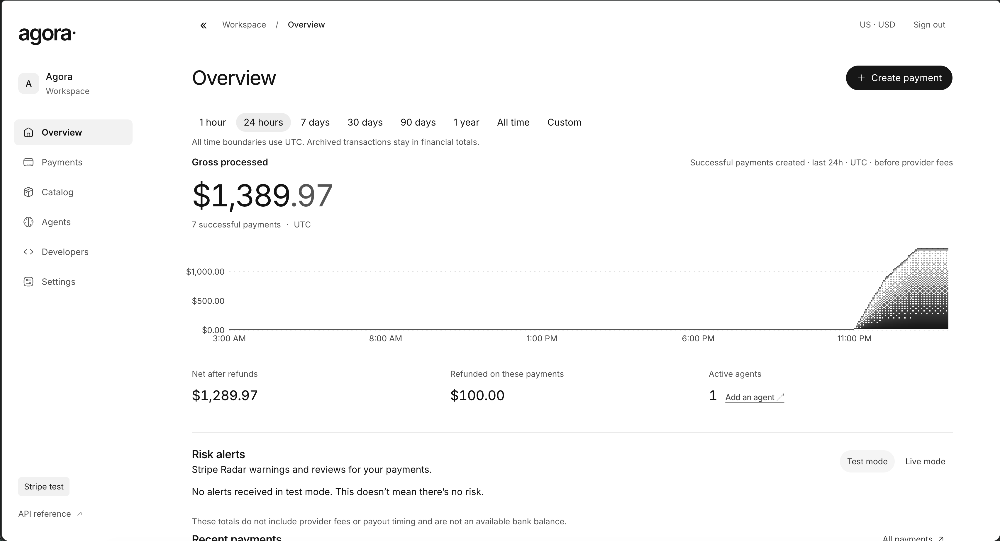

<div align="center">
  <h1>Agora Community</h1>
  <p>Simple payments for your business.</p>
  <p>
    <a href="https://github.com/pkyanam/agora-payments"></a>
    <a href="https://github.com/pkyanam/agora-payments/commits/main"></a>
  </p>
</div>



## Install

Open Terminal and paste:

```bash
curl -fsSL https://raw.githubusercontent.com/pkyanam/agora-payments/main/community-install.sh | bash
```

Follow the prompts to choose local, Boat, or Cloudflare; local and Boat installs print a one-time owner setup URL after successful setup, while Cloudflare keeps its bootstrap credentials in a private file. Open the setup URL to choose an owner email and password and enroll MFA, then start Agora with the command shown.

Rerun the same command to update an existing installation, selecting the same target. Boat installs require the Boat CLI to be installed and signed in.

## Need help?

Run `agora --help` or [open an issue](https://github.com/pkyanam/agora-payments/issues).
